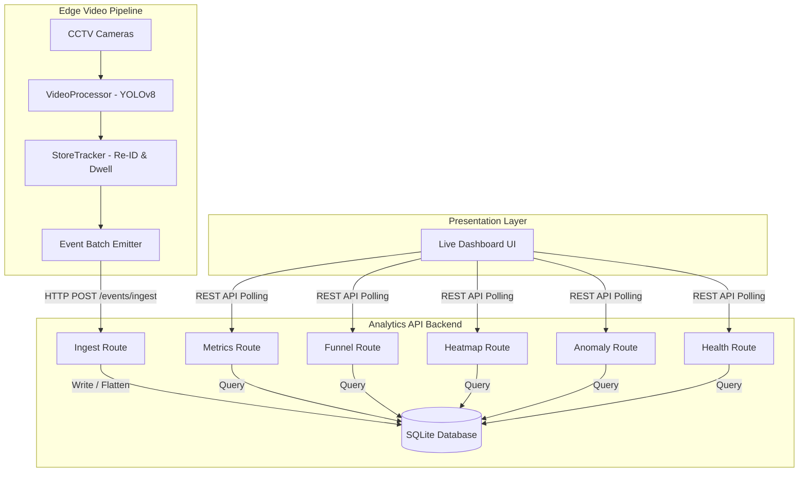

# DESIGN.md - Apex Retail Store Intelligence Architecture

This document describes the high-level architecture, pipeline processing stages, and core engineering decisions behind the **Apex Retail Store Intelligence** system.

---

## 1. System Overview

The Store Intelligence system translates raw CCTV camera feeds into actionable business intelligence (Unique Visitors, Zone Heatmaps, Dwell Times, Billing Queue depths, and Conversion Rates) in real-time. It consists of three decoupled layers:

---

## 2. Ingestion Pipeline & Event Model

The system operates on an **event-driven model**. As objects are tracked across cameras, events are emitted to the `/events/ingest` bulk endpoint.

### Core Event Schema
Each event represents a high-confidence visual track state:
- `event_id`: Unique UUID v4.
- `store_id`: Associated retail store (e.g. `STORE_BLR_002`).
- `camera_id`: Source camera (e.g. `CAM_ENTRY_01`, `CAM_MAIN_02`).
- `visitor_id`: Unified customer tracking ID (e.g. `VIS_c4b12a`).
- `event_type`: State action:
  - `ENTRY`: Customer crossed the entrance threshold.
  - `EXIT`: Customer crossed the exit threshold.
  - `ZONE_ENTER`: Customer walked into a monitored area (e.g., `SKINCARE`).
  - `ZONE_EXIT`: Customer left a monitored area.
  - `ZONE_DWELL`: Periodic heartbeat while staying inside a zone.
  - `BILLING_QUEUE_JOIN`: Customer joined the check-out queue.
  - `REENTRY`: Customer exited and walked back in within a brief period.
- `timestamp`: UTC ISO-8601 string.
- `dwell_ms`: Milliseconds spent in the previous state (primarily for exit/dwell events).
- `is_staff`: Flag designating whether the individual is store staff.

---

## 3. Computer Vision & Tracker Logic

The `pipeline/` package handles detection and object tracking:
1. **Detection (`detect.py`)**: Uses a **YOLOv8** model fine-tuned for human detection. Runs in real-time or gracefully degrades to simulation if hardware/packages are missing.
2. **Object Correlation & Re-ID (`tracker.py`)**: 
   - Tracks are maintained per-camera using bounding box overlap (IoU).
   - **Cross-Camera & Intertemporal Re-ID**: When a customer disappears from one camera and appears on another, or exits and re-enters, the tracker runs a proximity Re-ID.
   - **Re-ID Rules**:
     - *Window*: Within **60 seconds**.
     - *Spatial Distance*: Within **150 pixels** threshold from the last recorded boundary coordinates.
     - Re-ID matches maintain the same `visitor_id`, preventing session duplication.

---

## 4. Key Metrics Calculation

Analytics APIs dynamically query the SQLite store to compute crucial retail indicators:

### Unique Visitors
Counts distinct `visitor_id` records that have an `ENTRY` event but excludes staff members (`is_staff = 0`).

### Conversion Rate
Calculates the ratio of buying visitors to total visitors:
- **Conversion Criterion**: A visitor is converted if they have a `ZONE_ENTER` event at the `BILLING` zone, and a POS transaction is recorded at the same `store_id` within a **5-minute window** of that billing entry.
- Formula: $\text{Conversion Rate} = \frac{\text{Unique Converted Visitors}}{\text{Unique Visitors}}$

### Avg Dwell Time by Zone
Queries `ZONE_EXIT` and `ZONE_DWELL` events to calculate the average milliseconds spent per zone.

### Queue Depth & Abandonment
- **Queue Depth**: Number of active individuals currently in the `BILLING` zone (joined queue but have not yet exited).
- **Abandonment Rate**: Percentage of customers who entered the `BILLING` queue but exited the store layout *without* a corresponding POS transaction.

---

## 5. Anomaly Detection Algorithms

The backend runs real-time heuristics to spot inefficiencies:
- **Billing Queue Spikes**: Alert triggered if `queue_depth > 5` inside a store (Severity: `WARNING` / `CRITICAL`).
- **Dead Zone Detection**: Alert triggered if a zone has 0 visits over a configured window (e.g., 20 minutes) despite active store traffic.
- **Conversion Drops**: Alert triggered if the conversion rate falls below `15%` under high footfall conditions.

---

## 6. Live Dashboard Design

The presentation layer is built as a single-page reactive application:
- **Glassmorphic Grid Layout**: Sleek dark theme that matches modern executive command dashboards.
- **Real-Time Polling**: Automatic polling of FastAPI analytics routes every 5 seconds.
- **Chart.js Visualizations**: Displays a horizontal multi-stage conversion funnel and progress bar zone visit heatmaps.
- **Dynamic Updates**: Interactive store layouts can be toggled on-the-fly, smoothly updating UI states.
